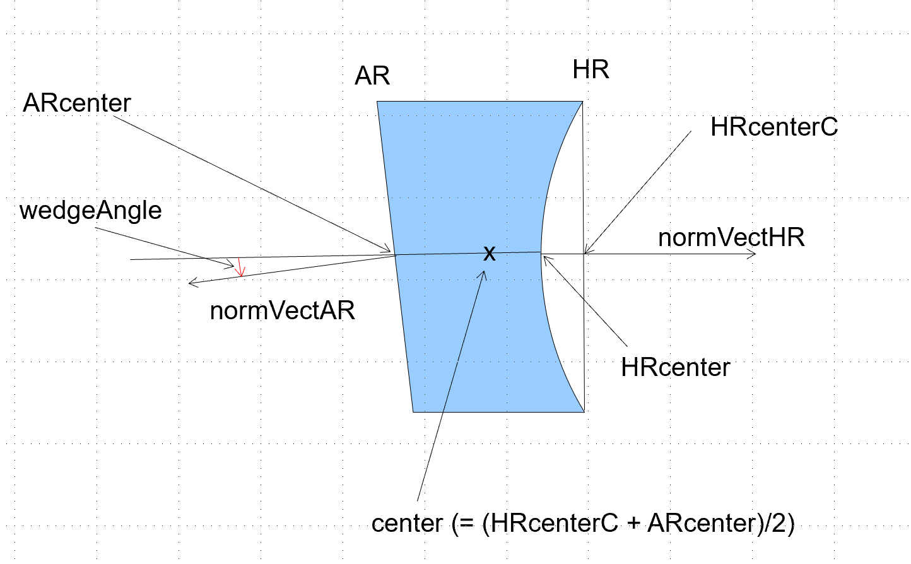

Basic Concepts
===============================

In this section, basic concepts of gtrace will be introduced.

2D plane
---------------

In gtrace world, an optical system will be placed on a two dimentional plane. A location on the plane is specified by a set of Cartesian coordinates (x, y). This just a normal x-y plane. The origin of the axes is at the lower left of the plane. The X-axis extends horizontally to the right. The Y-axis goes up vertically. Nothing more to add here.

Direction
-----------

.. image:: imgs/Direction.*
   :height: 5cm

While working with optical layouts, one often has to specify a direction in the 2D plane such as the orientation of a mirror or the propagation direction of a beam. In gtrace, in most cases, a direction can be specified in two ways. One way is to use an angle measured from the X-axis in counter clockwise (``dirAngle`` in the figure above). The other way is to use a 2D vector of length 1. If a direction can be specified either way, you only have to specify it in one of those methods. For example, the :py:class:`GaussianBeam<gtrace.beam.GaussianBeam>` class has an attribute called ``dirVect``. It holds a 2D vector in the form of ``numpy.Array``. The :py:class:`GaussianBeam<gtrace.beam.GaussianBeam>` class also has an attribute called ``dirAngle``, which holds the angle of the beam propagation direction measured from the X-axis in radian.  When one of the two attributes is changed, the other is updated automatically to be consistent with the modification. Therefore, you don't have to worry about the consistency. For the direction vector, it is also automatically normalized. Therefore, you can assign it a vector of any norm.

Beam
-----------

.. image:: imgs/Beam.*
   :height: 10cm

A Gaussian beam is represented by an instance of :py:class:`GaussianBeam<gtrace.beam.GaussianBeam>` class. The most fundamental properties of a beam is its position (``pos``) and the direction of propagation (``dirVect`` or ``dirAngle``). 

Mirror
-----------

Mirror is a basic optical component in gtrace. Even though the name is \"Mirror\", it can represent a transparent optical window, a prism, a spherical lense, light absorbing plate (like black glass) and so on. A mirror object has two surfaces, called HR and AR. These surfaces can be flat or curved. Curved surfaces are spherical. If you need a cylindrical surface, use ``CyMirror`` class instead.

The parameters of a Mirror object are shown in the figure above.
