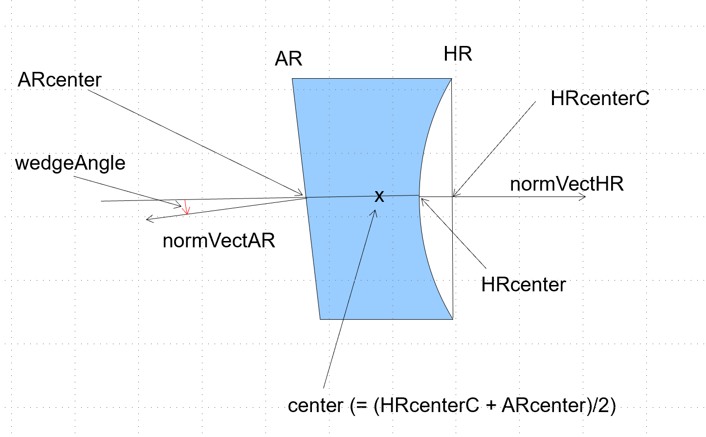

Basic Concepts
===============================

In this section, basic concepts of gtrace will be introduced.

2D plane
---------------

In gtrace world, an optical system will be placed on a two dimentional plane. A location on the plane is specified by a set of Cartesian coordinates (x, y). This just a normal x-y plane. The origin of the axes is at the lower left of the plane. The X-axis extends horizontally to the right. The Y-axis goes up vertically. Nothing more to add here.

Direction
-----------

.. image:: imgs/Direction.*
   :height: 5cm

While working with optical layouts, one often has to specify a direction in the 2D plane such as the orientation of a mirror or the propagation direction of a beam. In gtrace, in most cases, a direction can be specified in two ways. One way is to use an angle measured from the X-axis in counter clockwise (``dirAngle`` in the figure above). The other way is to use a 2D vector of length 1. If a direction can be specified either way, you only have to specify it in one of those methods. For example, the :py:class:`GaussianBeam<gtrace.beam.GaussianBeam>` class has an attribute called ``dirVect``. It holds a 2D vector in the form of ``numpy.Array``. The :py:class:`GaussianBeam<gtrace.beam.GaussianBeam>` class also has an attribute called ``dirAngle``, which holds the angle of the beam propagation direction measured from the X-axis in radian.  When one of the two attributes is changed, the other is updated automatically to be consistent with the modification. Therefore, you don't have to worry about the consistency. For the direction vector, it is also automatically normalized. Therefore, you can assign it a vector of any norm.

Beam
-----------

.. image:: imgs/Beam.*
   :height: 10cm

A Gaussian beam is represented by an instance of :py:class:`GaussianBeam<gtrace.beam.GaussianBeam>` class. The most fundamental properties of a beam is its position (``pos``) and the direction of propagation (``dirVect`` or ``dirAngle``).

Mirror
-----------

Mirror is a basic optical component in gtrace. Even though the name is \"Mirror\", it can represent a transparent optical window, a prism, a lens, a light absorbing plate (like black glass) and so on. A mirror object has two surfaces, called HR and AR. These surfaces can be flat or curved. Curved surfaces are spherical. If you need a cylindrical surface, use :py:class:`CyMirror<gtrace.optcomp.CyMirror>` instead, described under :ref:`cylindrical-surfaces` below. For a lens, :py:class:`Lens<gtrace.optcomp.Lens>` is the same substrate ordered by its focal length instead of by the radii of its two faces.

The parameters of a Mirror object are shown in the figure above.

The curvature of a surface is held as its *inverse* radius, ``inv_ROC_HR`` and ``inv_ROC_AR``, so a flat surface is zero and needs no special case. The GUI viewer shows you the radius itself and converts on the way in and out.

.. _changing-a-curvature:

Changing a curvature
~~~~~~~~~~~~~~~~~~~~~

A curved surface is an arc, and an arc has two natural reference points: the apex, where it crosses the optical axis, and the centre of the chord it spans, out at the rim. They lie a *sagitta* apart, and the sagitta depends on the radius. ``HRcenter`` is the apex and ``HRcenterC`` the chord centre; ``ARcenter`` and ``ARcenterC`` are the same pair on the back face. The thickness of the substrate is measured between the two chord planes, so it is the thickness at the rim.

Assigning a new curvature therefore has to move one of the two points. Which one it should be depends on what you are doing::

    M.inv_ROC_HR = 1.0/newROC

By default the *apex stays put* and the substrate slides back behind it. This suits a reflective telescope, which is tuned by sweeping the radii of its mirrors to get the magnification right. The layout puts the beam spot on the HR surface, and the sweep is meant to change the beam size, not to move the beam::

    for R in np.arange(-30, -20, 0.5):
        MMT1.inv_ROC_HR = 1.0/R
        layout.trace()          # the beam still lands where it did

For an optics the beam passes *through*, that is the wrong choice. There is no spot on a surface to keep still, and what is bolted to the bench is the substrate. Setting ``anchor_point`` to ``'center'`` keeps the middle of the substrate where it is and lets the faces move on it::

    M.anchor_point = 'center'
    M.inv_ROC_HR = 1.0/newROC   # M.center unchanged, M.HRcenter moves

:py:class:`Lens<gtrace.optcomp.Lens>` defaults to ``'center'`` for this reason; :py:class:`Mirror<gtrace.optcomp.Mirror>` and :py:class:`CyMirror<gtrace.optcomp.CyMirror>` default to ``'HRcenter'``.

Either way the rest of the substrate follows. The far face, the sides and the centre are all recomputed, so the body stays closed and the tracer and the drawing agree about where it is. The anchor only chooses which end of the sagitta is held fixed while that happens.

The anchor point is also what the optics *turns about*. Assigning ``normAngleHR`` or ``normVectHR`` rotates the substrate rigidly about the anchor, and so does ``rotate()`` by default. A mirror pivots the apex of its HR face, so steering it does not walk the beam spot off it, which is what ``rotate()`` has always done. A lens pivots the middle of its substrate, so turning it does not carry it up the bench. ``rotate(a, center=True)`` pivots the middle whatever the anchor says, and ``rotate(a, center=[x, y])`` a given point.

Changing ``diameter`` goes through the same machinery, since the sagitta depends on the aperture as well as on the radius. Changing ``inv_ROC_AR`` never moves the substrate at all: the back face has no spot to keep still, so its chord plane stays and only its apex moves.

Asking where the substrate is
~~~~~~~~~~~~~~~~~~~~~~~~~~~~~~

Two methods answer questions about the body itself, not about a beam meeting it.

:py:meth:`get_corners<gtrace.optcomp.Mirror.get_corners>` gives the four corners, going round: the two ends of the HR chord, then the two ends of the AR chord. The wedge is in them, and it is what makes the two sides different lengths. So is the fact that a curved face meets the sides at its chord and not at its apex. :py:meth:`get_side_info<gtrace.optcomp.Mirror.get_side_info>` describes the sides as centre, normal and length, which is what hit testing needs; this gives the points, which is what anything pointing at the element needs.

:py:meth:`contains_segment<gtrace.optcomp.Optics.contains_segment>` says whether a straight span lies wholly inside the substrate::

    M.contains_segment(M.HRcenter, M.ARcenter)      # True: the optical thickness

It asks the optics instead of describing its faces a second time. :py:meth:`isHit<gtrace.optcomp.Mirror.isHit>` reports a surface only when it is approached from *outside*, and refuses any face the ray is leaving through, so from inside a substrate it finds nothing at all in any direction. That is the whole of the test. A face found partway along the span means the span starts outside. Ends lying exactly on a face count as inside, since that is where such a measurement is usually taken from.

The hollow of a concave face is the case to keep in mind. It is enclosed by the substrate on three sides, and a test that only asked how far the material reaches along a line would call it inside. It is air, and a span across the front of a concave mirror is a span through air. :py:meth:`contains_point<gtrace.optcomp.Optics.contains_point>` therefore looks *both* ways from the point before deciding.

.. _cylindrical-surfaces:

Cylindrical surfaces
~~~~~~~~~~~~~~~~~~~~

:py:class:`CyMirror<gtrace.optcomp.CyMirror>` is the same substrate with cylindrical faces instead of spherical ones. ``curve_direction`` says which plane the cylinder curves in: ``'h'`` in the plane of the trace, ``'v'`` out of it. The other plane is flat, and a beam passing through it comes out with the divergence it went in with.

Two things follow from working in 2D. First, only ``'h'`` is visible in the drawing. A ``'v'`` mirror is drawn with straight faces, because a straight line is what the plane of the trace cuts out of it, and its focusing happens out of the page. Second, the two directions are not a relabelling of each other. At an angle of incidence :math:`\theta` a curved surface presents an effective radius :math:`R\cos\theta` in the plane of incidence and :math:`R/\cos\theta` perpendicular to it, so an ``'h'`` mirror has a focal length of :math:`R\cos\theta/2` and a ``'v'`` mirror of the same radius :math:`R/2\cos\theta`. At 45 degrees they differ by a factor of two. Only at normal incidence do the two agree.

Transmission through a cylindrical face is worth stating separately, because it is easy to assume more than is true. The uncurved plane loses the *power* of the surface and nothing else. A tilted face still changes the width of the beam in the plane of incidence, and still carries the change of refractive index. Only in *reflection* is the uncurved plane left with the identity.

The ray matrices are those of Siegman, *Lasers*, Table 15.1, with the curvature given to one plane and zero to the other. ``tests/cymirror_verification.ipynb`` works through the comparison, and ``tests/gui/verify_cylindrical.py`` runs it as counted assertions.

A lens with cylindrical faces is :py:class:`CyLens<gtrace.optcomp.CyLens>`, ordered by focal length like any other lens; see :ref:`below <cylindrical-lens>`.

Lens
-----------

A lens is a substrate whose two faces both refract, which a
:py:class:`Mirror<gtrace.optcomp.Mirror>` with two curved surfaces and a
low reflectivity already is. What :py:class:`Lens<gtrace.optcomp.Lens>`
adds is the way you order one: by focal length::

    from gtrace.optcomp import Lens
    from gtrace.unit import mm, inch

    L = Lens(f=500*mm)                                    # biconvex, 1 inch
    L = Lens(f=-100*mm, thickness=3*mm)                   # f < 0 comes out biconcave
    L = Lens(f=150*mm, shape='convex-plano')              # curved front, flat back
    L = Lens(f=150*mm, shape='meniscus', ROC_HR=-60*mm)

``shape`` is spelt the way a catalogue spells it, the front face first and the back face second, so ``'plano-convex'`` and ``'convex-plano'`` are the same lens the two ways round. Left out, it gives an equiconvex lens for a positive focal length and an equiconcave one for a negative one. Asking for a shape that contradicts the sign of the focal length raises an error.

The radii are solved for as a *thick* lens, which is what gtrace then traces: the beam refracts at both faces with the substrate in between. Radii taken from the thin lens formula would land a few parts in a thousand off, and considerably further for a short focal length. ``thickness`` is the :py:class:`Mirror<gtrace.optcomp.Mirror>` thickness, measured between the two chord planes, so it is the thickness at the rim. ``center_thickness`` reports the distance between the apexes that a catalogue would quote.

A lens that cannot be made out of the blank it was given is refused, with the number you need in the message: two concave faces that would meet in the middle, a face steeper than its own aperture, or a focal length no substrate of that thickness can reach.

Both faces reflect nothing by default, so a lens makes no ghost beams. A real lens does reflect, but a system of them produces so many faint ghosts that the picture becomes unreadable and the trace slow, and most of the time a lens is in a layout to bend the main beam. Ask for those ghosts when you want them::

    L = Lens(f=500*mm, Refl_HR=0.005, Trans_HR=0.995,
             Refl_AR=0.005, Trans_AR=0.995)

The ghosts so ordered are counted as ghosts: a reflection off either face of a lens raises the beam's stray order, where the reflection off a mirror's HR does not. See :ref:`stray-order`.

The focal length is not stored. Reading ``f`` computes it from the curvatures, the thickness and the index as they stand. Assigning to it reshapes the faces to match, keeping the shape of the lens and leaving it where it is. Tuning a lens against a mode matching target is therefore a loop::

    for f in np.arange(150, 400, 10)*mm:
        L.f = f
        layout.trace()
        ...

.. _cylindrical-lens:

Cylindrical lens
~~~~~~~~~~~~~~~~

:py:class:`CyLens<gtrace.optcomp.CyLens>` is ordered exactly like a
:py:class:`Lens<gtrace.optcomp.Lens>` — same ``f``, same shapes, same
solver, same refusals — and shaped like a
:py:class:`CyMirror<gtrace.optcomp.CyMirror>`: both faces are cylinders
sharing one ``curve_direction``, so the focal length lives in that
plane and the other plane sees a plain window::

    from gtrace.optcomp import CyLens

    L = CyLens(f=500*mm)                       # focuses in the plane of the drawing
    L = CyLens(f=500*mm, curve_direction='v')  # focuses out of it

Everything said about :ref:`cylindrical surfaces
<cylindrical-surfaces>` applies. A ``'v'`` lens is drawn as the
rectangle the plane of the trace cuts out of it, and its focusing
happens out of the page, carried by the beam's ``qy``. The quoted
``f`` is the normal-incidence value, and at a tilt the two planes
scale differently. In the flat plane the lens is a window rather than
nothing: a tilted flat face still rescales the beam width in its plane
of incidence, and the substrate is still a length of glass.

Optical systems
----------------

Mirrors and beams are enough on their own, and the :doc:`tutorial` uses nothing else. When a system grows to the point where carrying lists of optics and beams around becomes the bulk of the code, :py:class:`OpticalLayout<gtrace.layout.OpticalLayout>` collects the optics, the source beams and the tracing rules into one object that can be traced, drawn, saved and edited interactively. See :doc:`layout`.
