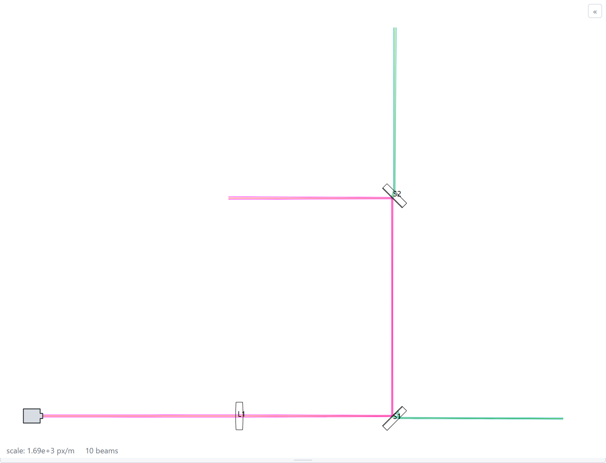
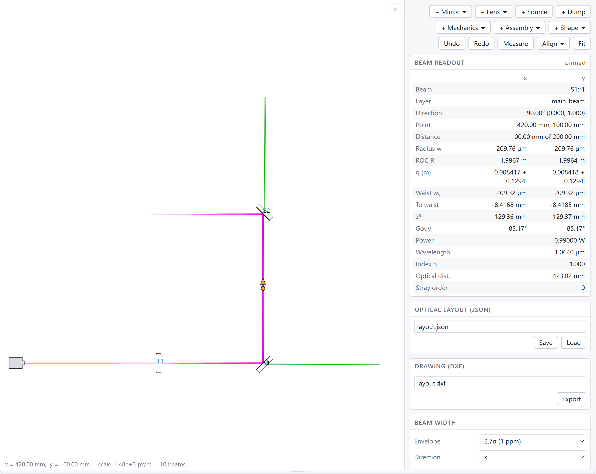

Introduction
=============

gtrace traces Gaussian beams through an optical system laid out on a bench.
You place mirrors and lenses in Python and trace the beams. You look at the
result in a browser and move the elements until the layout is right. When
the layout is finished, you export the drawing to DXF.

   The bench built by the code in "A first layout" below, seen in
   gtrace's viewer.

What gtrace does:

* You place the elements and gtrace computes the rest. Which surface a
  beam hits next, where the beam goes and which new beams each surface
  produces are all computed, not declared.
* gtrace computes reflection and refraction at every surface. The trace
  therefore includes the faint ghost beams from anti-reflection coatings,
  not only the main beam.
* gtrace multiplies the ABCD matrices along every beam. The beam radius,
  the wavefront curvature, the waist and the accumulated Gouy phase are
  therefore known at every point of every beam.
* Optical path length accumulates through glass as well as through air.
* You can read the result by clicking in the viewer, save it as JSON,
  send it to somebody as a single HTML page, or export it to DXF for CAD.

gtrace works in two dimensions: everything lies on one plane. Two
dimensions are enough for a bench layout, the case gtrace was written for.

Installation
-------------

Python 3.9 or newer::

    pip install "gtrace[notebook]"

Write the quotes around ``gtrace[notebook]``. In zsh, brackets without
quotes are read as a glob.

This installs gtrace and both viewers: the notebook widget, which runs
inside a Jupyter notebook, and the HTML viewer, a standalone page that
opens in a web browser.

It does not install Jupyter itself. If you do not have Jupyter::

    pip install jupyterlab

VS Code's notebook editor works instead of JupyterLab: open the ``.ipynb``
file and select the interpreter you installed gtrace into.

If you do not use notebooks, ``pip install gtrace`` installs gtrace and the
HTML viewer, without the notebook widget.

To install from a git clone instead, see "Installing from a git clone" at
the end of this page.

A first layout
---------------

A laser, a lens and two steering mirrors. The code below runs in a notebook
or in a plain script, and uses no notebook-specific feature.

.. code-block:: python

    import numpy as np

    import gtrace.optcomp as opt
    from gtrace.beam import GaussianBeam
    from gtrace.layout import OpticalLayout, TraceRules, q_from_waist
    from gtrace.unit import *          # mm, cm, inch, nm, ppm, deg2rad, ...

    # The laser: a 0.4 mm waist where the beam starts, aimed along +x.
    laser = GaussianBeam(q0=q_from_waist(0.4*mm, 0.0, 1064*nm), wl=1064*nm,
                         pos=[0.10, 0.0], dirAngle=0.0, P=1.0, name='in')

    L1 = opt.Lens(f=250*mm, center=[0.28, 0.0], normAngleHR=np.pi,
                  diameter=1*inch, thickness=6*mm, n=1.45, name='L1')

    S1 = opt.Mirror(HRcenter=[0.42, 0.0], normAngleHR=deg2rad(135),
                    diameter=1*inch, thickness=6*mm,
                    Refl_HR=0.99, Trans_HR=0.01, n=1.45, name='S1')

    S2 = opt.Mirror(HRcenter=[0.42, 0.20], normAngleHR=deg2rad(-135),
                    diameter=1*inch, thickness=6*mm,
                    Refl_HR=0.99, Trans_HR=0.01, n=1.45, name='S2')

    layout = OpticalLayout(optics=[L1, S1, S2], sources=[laser],
                           rules=TraceRules(order=2, power_threshold=1e-4,
                                            open_beam_length=15*cm),
                           name='Bench')

    print('%d beams' % len(layout.trace()))

::

    10 beams

Reading the code from the top:

**Units.** Lengths are in metres and angles are in radians. ``gtrace.unit``
gives you ``mm``, ``cm``, ``inch``, ``nm``, ``ppm`` and other units as plain
multipliers, and ``deg2rad`` for angles. You can therefore write ``250*mm``
and ``deg2rad(135)``.

**The source beam.** A :py:class:`GaussianBeam<gtrace.beam.GaussianBeam>`
starts at ``pos`` and travels in the direction ``dirAngle``, measured from
the x axis counterclockwise. The beam shape is the complex beam parameter
``q0``. :py:func:`q_from_waist<gtrace.layout.q_from_waist>` builds a ``q0``
from a waist radius, the distance from that waist to where the beam starts,
and the wavelength.

**The elements.** :py:class:`Lens<gtrace.optcomp.Lens>` is specified by its
focal length ``f``. gtrace solves for the curvatures of the two faces from
``f``, the thickness and the index of refraction.
:py:class:`Mirror<gtrace.optcomp.Mirror>` has two surfaces, the front face
HR and the back face AR. ``HRcenter`` places the front face and
``normAngleHR`` is the direction the HR normal points, so
``deg2rad(135)`` turns a beam travelling along +x into a beam travelling
along +y. ``Refl_HR=0.99, Trans_HR=0.01`` say that one part in a hundred
passes through the mirror instead of reflecting. The trace therefore
returns ten beams from a bench with only three elements on it.

**The layout.** :py:class:`OpticalLayout<gtrace.layout.OpticalLayout>` is
the whole system in one object: the elements, the source beams, and the
rules the trace runs under. :py:class:`TraceRules<gtrace.layout.TraceRules>`
holds three rules:

.. list-table::
   :header-rows: 1
   :widths: 30 70

   * - Rule
     - What the rule sets
   * - ``power_threshold``
     - How faint a beam has to get before it stops being followed. Lower
       ``power_threshold`` to follow more ghost beams, at the cost of time.
   * - ``order``
     - How many ghost reflections a beam may go through before it stops
       being followed. Every beam carries the count. The count is not
       reset when the beam leaves one element for the next, so ``order``
       limits the whole trace. See :ref:`stray-order`.
   * - ``open_beam_length``
     - How long a beam that hits nothing is drawn. The default is 1 m;
       15 cm keeps the stray beams from covering this small bench.

**The trace.** :py:meth:`trace()<gtrace.layout.OpticalLayout.trace>`
releases each source beam, follows it wherever the geometry takes it, and
returns every beam produced on the way.

Showing the result
-------------------

::

    layout.show()

In a Jupyter notebook, ``show()`` puts the viewer in the cell output.
Anywhere else, ``show()`` writes a self-contained HTML file and opens it in
your browser.

The two viewers show the same drawing and report the same numbers for each
beam. They differ in what they can change. The notebook widget has a
running Python kernel behind it, so the widget can edit the layout and
trace it again. The HTML viewer has no kernel, so it is read-only: you can
pan, zoom, click a beam and measure a distance, but not move anything.

   The bench in the notebook widget, with the beam between the two steering
   mirrors clicked.

Click anywhere along a beam, not only at a corner. The panel then shows the
properties of that beam *at that point*: the radius, the wavefront radius
of curvature (ROC), the complex q, the waist radius, the distance to the
waist, the Rayleigh range, the accumulated Gouy phase, the power, and the
optical path travelled so far. The x and y columns are separate, because a
beam is not round in general.

Click an element and the panel shows the element properties instead, and
lets you change them.

Drag the background to pan and use the wheel to zoom; ``Fit`` frames the
whole layout again. The buttons along the top of the widget add elements,
align one element to a beam, measure a distance, and undo. :doc:`viewer`
describes all of the buttons.

Changing the layout
--------------------

Working with gtrace is a loop: place an element, look at what the beams do,
move the element. Python and the widget reach the same objects.

From Python, keep the widget in a variable and call ``update()`` after a
change:

.. code-block:: python

    w = layout.widget()
    w                                # the viewer appears in the cell output

.. code-block:: python

    S2.HRcenter = [0.42, 0.30]       # 100 mm further along the beam
    w.update()                       # re-trace and redraw

From the widget, drag an element to move it, ctrl-drag it onto a beam to
align it, or type a new number into the properties panel. Those edits reach
the objects in your notebook, because the layout holds the optics by
reference and does not copy them::

    >>> layout.get_optics('S2') is S2
    True

So the mirror you dragged in the browser is the ``S2`` your next cell sees.

Saving and exporting
---------------------

.. code-block:: python

    layout.save('bench.json')          # the model, to reload or to send
    layout.render_html('bench.html')   # one page you can send to somebody
    layout.export_dxf('bench.dxf')     # geometry for CAD

:py:meth:`update_from_file<gtrace.layout.OpticalLayout.update_from_file>`
reads a saved layout back into the objects you already have, so you can
undo an unwanted change by reloading.

The beams are ordinary Python objects, so you can use the numbers in your
own code:

.. code-block:: python

    beams = layout.trace()
    after_lens = [b for b in beams if b.name == 'L1:t1'][0]

    waist = after_lens.waist()
    print('waist %.1f um, %.0f mm past the lens'
          % (waist['Waist Size'][0]/um, waist['Waist Position'][0]/mm))

::

    waist 209.3 um, 228 mm past the lens

The viewer cannot do this. Your code can build a layout from a search, an
optimisation or a loop over a catalogue of stock lenses, and open the
viewer only afterwards.

Where to go next
-----------------

.. list-table::
   :header-rows: 1
   :widths: 55 45

   * - If you want to
     - Read
   * - Work through a real example from end to end
     - :doc:`tutorial`
   * - Match a laser into a cavity with two lenses
     - :doc:`the mode matching example<tutorial/modematching>`
   * - Know what the coordinates, mirrors and lenses mean
     - :doc:`basic_concepts`
   * - Understand what happens at a surface, and where the ghost
       beams come from
     - :doc:`propagation`
   * - Use everything ``OpticalLayout`` can do: mechanics,
       assemblies, dimensions, undo, JSON
     - :doc:`layout`
   * - Use everything the viewer can do
     - :doc:`viewer`
   * - Drive a layout from code the way the viewer does, or write a
       front end of your own
     - :doc:`editing`

Read :doc:`propagation` early. That chapter explains where the ghost beams
come from and how they are counted, so that you can choose ``order`` and
``power_threshold`` for a reason, instead of changing them until the
picture looks right.

Mirrors and beams also work without a layout. You can pass a beam to a
mirror, get the reflected and transmitted beams, and keep track of them
yourself. The last chapter of the :doc:`tutorial` builds a cavity that way
and registers it in a layout afterwards. Work this way when the element
positions have to be computed instead of typed in.

Installing from a git clone
----------------------------

To track gtrace's own development, or to edit gtrace itself::

    git clone https://github.com/asoy01/gtrace.git
    cd gtrace
    pip install -e ".[notebook]"

The tutorial notebooks are in ``docs/source/tutorial/``. They need only
gtrace and nothing else from the repository, so you can download the
``.ipynb`` files on their own. :doc:`tutorial` links to them.
