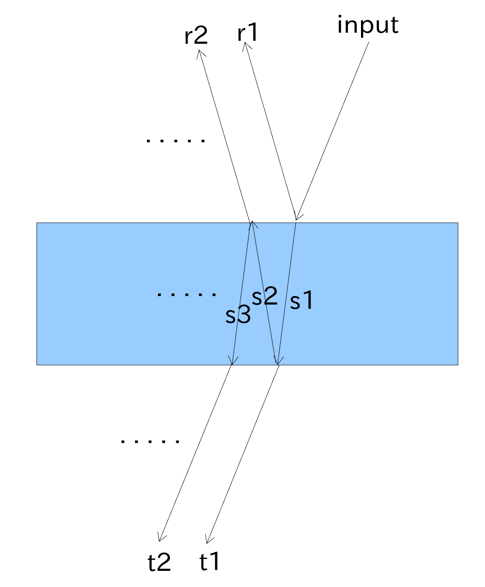

Propagation of a beam
===============================

A beam can be propagated either by manually propagate for a certain distance or tell gtrace to propagate it until hitting a particular mirror.

The manual propagation can be performed by calling, ``beam.propagate(d)`` where ``d`` is the distance to propagate.

Hitting a mirror
---------------

By calling ``Mirror.hitFromHR(beam)``, you can tell gtrace to propagate the beam until it hits the mirror. If the beam indeed hits the mirror, gtrace will generate a set of beam objects produced by the interactions (reflection and refraction) of the incident beam with the mirror.

The generated beams are given the names indicated in the figure above.
The beam objects will be returned as a dictionary with the name of a beam as a key.