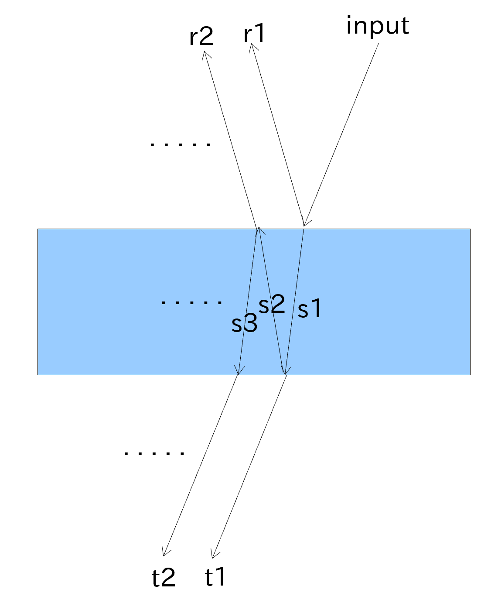

Propagation of a beam
===============================

A beam can be propagated either by manually propagate for a certain distance or tell gtrace to propagate it until hitting a particular mirror.

The manual propagation can be performed by calling, ``beam.propagate(d)`` where ``d`` is the distance to propagate.

Hitting a mirror
-----------------

By calling ``Mirror.hitFromHR(beam)``, you can tell gtrace to propagate the beam until it hits the mirror. If the beam indeed hits the mirror, gtrace will generate a set of beam objects produced by the interactions (reflection and refraction) of the incident beam with the mirror.

The generated beams are given the names indicated in the figure above.
The beam objects will be returned as a dictionary with the name of a beam as a key.

Non-sequential trace
---------------------

Following every beam by hand is fine for a handful of surfaces, but a real layout produces ghost beams faster than anyone wants to chase them. :py:func:`non_seq_trace<gtrace.nonsequential.non_seq_trace>` does it for you: give it a list of optics and one source beam, and it propagates every beam that is generated until a termination condition is met.

.. code-block:: python

    from gtrace.nonsequential import non_seq_trace

    beams = non_seq_trace([PRM, PR2, PR3], src,
                          order=10, power_threshold=1e-3)

A beam stops being followed when it hits nothing, when its power falls below ``power_threshold``, or when the number of internal reflections reaches ``order``. The return value is a flat list of the beams that were produced; each carries a ``stray_order`` saying how many ghost reflections it took to make it, which is what separates the main beam from the ghosts when drawing.

``order`` applies to the trace as a whole. An individual element can override it through its ``max_stray_order`` attribute, because how deep the ghosts of one particular element are worth chasing is a property of that element.

If you keep your system in an :py:class:`OpticalLayout<gtrace.layout.OpticalLayout>`, ``layout.trace()`` runs this for every registered source with the layout's rules. See :doc:`layout`.