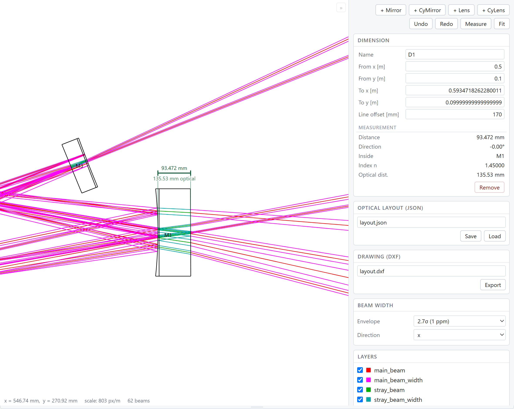

The viewer
===============================

Historically the only way to look at a trace was to write a DXF file and open it in CAD software. That works, but it is a slow loop, it requires a CAD program on every machine that wants to look at a result, and the DXF carries no physics: it is a drawing, so there is nothing in it to ask about the beam.

gtrace ships a viewer that answers those three points. It draws the same scene, needs no software beyond a browser, and carries the q-parameters of the beams alongside the geometry, so you can click anywhere along a beam and read out what the beam is doing *at that point* — not only at the vertices.

.. code-block:: python

    layout.show()

That is the whole entry point. In a Jupyter notebook it returns a widget that renders in the output cell; anywhere else it writes a self-contained HTML file and opens it in your browser. Both drive the same viewer.

Three ways in
--------------

The viewer is one piece of dependency-free JavaScript with three front ends over it. They share a serializer and a scene format, so they show the same picture and report the same numbers.

.. code-block:: python

    layout.show()                       # picks the right one for you
    layout.render_html('trace.html')    # a file you can send to someone
    layout.widget()                     # a notebook cell output

**Self-contained HTML** — :py:meth:`render_html<gtrace.layout.OpticalLayout.render_html>` writes one file with the scene, the viewer code and the styling all inlined. There is no server and nothing to install. You can mail the file to a collaborator, who can read the beam parameters off it and take dimensions on it, and it will still open in ten years.

**Notebook widget** — :py:meth:`widget<gtrace.layout.OpticalLayout.widget>` embeds the viewer as a cell output. Because the Python kernel is still alive behind it, this is the one that can edit and re-trace. It needs ``anywidget``; without it, use the HTML backend.

**Explicit choice** — ``layout.show(backend='html')`` or ``backend='widget'`` overrides the automatic pick.

If you are not using an :py:class:`OpticalLayout<gtrace.layout.OpticalLayout>`, the renderer is callable directly, and can also be dropped into ``drawOptSys`` in place of the DXF renderer:

.. code-block:: python

    from gtrace.draw.viewer import renderHTML, html_render_func

    renderHTML(canvas, beams, 'trace.html', optics=optList)

    drawOptSys(optList, beamList, 'trace.html',
               render_func=html_render_func(beamList, optList))

Pass ``optics`` if you want to be able to click the elements. Without it the viewer draws them but has no way to say which is which.

Reading out a beam
-------------------

Click anywhere on a beam. The point is projected onto the beam segment, the q-parameter is advanced to that distance, and the panel reports, separately for the x and y directions where they differ:

============================ ==============================================
Radius ``w``                 Beam radius at the clicked point
ROC ``R``                    Radius of curvature of the wavefront there
``q``                        The complex q-parameter itself
Waist ``w₀``                 Radius at the waist of this beam
To waist                     Distance from the clicked point to the waist
``z_R``                      Rayleigh range
Gouy                         Accumulated Gouy phase
Power, wavelength, ``n``     Properties of the beam
Optical dist.                Optical path length accumulated so far
Stray order                  How many ghost reflections produced this beam
============================ ==============================================

This is why the DXF route is a dead end for interactive use, and why the viewer is not simply a DXF renderer pointed at a browser: the readout needs the beam objects, and a DXF has none.

Clicking an element instead of a beam opens its properties.

Controls
---------

Zoom with the wheel, centred on the cursor. Pan by dragging the background. Layers can be toggled individually, so the stray beams can be taken out of the way without re-running anything.

Making room
^^^^^^^^^^^^

A notebook cell is a letterbox and a bench drawing is not, so there are two ways to give the drawing more of it.

**Drag the bottom edge.** A grip runs along the bottom of the widget; dragging it down makes the viewer taller. The new height is written back to the ``height`` traitlet, so it survives a re-render and ``w.height`` reports what you dragged to. Dragging does not reframe the view — you are already looking where you meant to. Setting ``w.height`` from Python still does, since a height chosen there is usually a request to see the whole thing at that size.

**Fold the side panel away** with the small button at the top right of the drawing, which gives it the whole width. The button stays where it was, turned round, to bring the panel back; a button inside the panel could not.

The grip belongs to the widget. The written HTML file fills its window already, so there is nothing there for it to do.

Beam widths
^^^^^^^^^^^^

The side bar chooses how the envelope is drawn: the width in units of the 1/e² radius (1 σ, 2.7 σ or 3 σ) and which transverse direction it shows (x, y or their average). The default is 2.7 σ in x. See :ref:`why-2.7-sigma` for what those numbers mean.

Changing either redraws but does not re-trace: the display changed, the physics did not. The controls are absent from the static HTML, since redrawing needs Python; choose there at write time with ``render_html(..., width_mode='y')``.

Editing
--------

In the notebook widget the loop runs both ways. Clicking an element opens a properties panel where its position, orientation, size, curvature, refractive index, reflectivities and tracing flags can be edited. Elements can be added (``+ Mirror``, ``+ CyMirror``, ``+ Lens``, ``+ CyLens``), removed and renamed, and distances can be measured off the drawing (``Measure``).

Each edit is applied to the registered object, the layout is re-traced, and the new scene is pushed back into the view — keeping your current zoom, pan and layer visibility, so the picture does not jump underneath you.

An element turns about the point it is held by, which is what its **Anchor** names: a mirror swings about the apex of its HR face, so that turning it does not walk the beam spot off it, and a lens about the middle of its substrate. The outline that follows the cursor is drawn about that point too, so what you are shown while dragging is where the element ends up. The model itself turns the same way — assigning ``normAngleHR`` in a cell pivots the anchor point too; see :ref:`changing-a-curvature`.

Aligning to a beam
^^^^^^^^^^^^^^^^^^^

Almost every element on a bench is meant to sit square across a beam with the beam through its middle. Dragging gets an element approximately there and no closer, so **hold Ctrl while dragging**: drop it on a beam and it is turned to face that beam and slid onto its axis. The outline snaps as soon as Ctrl goes down, so nothing is left to faith, and the status bar names the beam it is about to sit on.

What has to be over the beam is the *element*, not the cursor: a beam passing anywhere within the element's own footprint counts. An element is grabbed wherever you took hold of it, and zoomed in that can be a long way from its middle, so a rule about the cursor would have made the whole thing stop working above a certain zoom.

Only the distance along the beam is taken from where you dropped it — which is the one of the three numbers a drag actually meant to choose. The other two, the angle and the offset across the beam, are the ones a bench does not leave to chance.

Which point of the element lands on the axis is again what the anchor names: the apex of the front face for a mirror, since that is where the beam stops, and the middle of the substrate for a lens, since the beam goes through. Ctrl with no beam under the cursor is an ordinary move.

The geometry is Python's: the browser says which beam and where along it, and :py:meth:`apply_edit<gtrace.layout.OpticalLayout.apply_edit>` works it out from the traced beam itself rather than from the copy of it in the page::

    layout.apply_edit({'op': 'align', 'target': 'L1',
                       'beam': 'b0', 'beam_index': 0,
                       'point': [0.4, 0.02]})

Moving along a beam by a number
^^^^^^^^^^^^^^^^^^^^^^^^^^^^^^^^

Aligning leaves one degree of freedom: how far along the beam the element sits. That one is not for a mouse — a lens goes where the mode matching says it goes — so the properties panel offers it as a number. Two rows appear under **Angle** whenever a beam passes through the selected element:

**Along beam** picks which beam, from those that actually reach the element — the same footprint a Ctrl-drag snaps over, less the element's own internal reflections, which have no axis outside it to move along. The nearest is chosen to start with. A 45° mirror has both an incoming and an outgoing beam through it, and which one "along" means is not something to guess at.

The list is also a picker, but a name like ``b0:M1t1`` says nothing about which line in the picture it is. So **Ctrl + click a beam** to name it instead: the row follows, the element stays selected, and the beam is marked along its whole length in the drawing so that the name and the line are visibly the same thing. Ctrl already means "this element, against that beam" in a drag, and it means the same here. Click the beam clear of the element — over the element, a click grabs the element, which is what a click there is for. Without Ctrl the click is the beam readout, exactly as before.

Ctrl + clicking the same place again steps to the next beam of the bundle, as clicking again does for the readout. Beams routinely lie on top of one another — a beam and its return share a line, and a stray often runs along a main beam — so pointing on its own cannot separate them, and the one meant is frequently not the nearest. Ctrl + clicking somewhere else starts the cycle over.

The mark carries an arrow halfway along it, showing which way the chosen beam travels. That is not decoration: it is the direction **Move by** counts as positive, and two beams sharing one line commonly run opposite ways, so stepping from one to the other would otherwise leave the picture unchanged while the sign of every move quietly reversed.

**Move by [mm]** is a distance to move, not a place to be: type it, press Enter, and the element slides that far, positive in the direction the beam travels. The field returns to zero at once, so leaning on Enter does not walk the element down the bench. It is in millimetres — the other row on the panel that is, along with the focal length — because an adjustment on a bench is spoken of in millimetres, and ``0.05`` invites the slip that unit exists to avoid.

Nothing else moves: not the orientation, not the offset across the beam. An element already square on the beam stays square and simply slides along it. The whole substrate translates, so which point of it is nominally being moved makes no difference::

    layout.apply_edit({'op': 'slide', 'target': 'L1',
                       'beam': 'b0', 'beam_index': 0,
                       'distance': 0.05})       # metres, downstream

Since the layout holds optics by reference, the object you edited in the browser is the object your own variable names:

.. code-block:: python

    w = layout.widget()
    w                       # displays the viewer; move PRM in it
    PRM.HRcenter            # shows where you moved it to

And in the other direction:

.. code-block:: python

    PRM.HRcenter = [0.6, 0]
    w.update()              # re-traces and redraws in place

``w.edits`` returns the edit messages received so far, oldest first, which is a convenient record of what you did by hand.

Curvature is presented as a radius of curvature rather than as the ``inv_ROC_HR`` the model stores, and converted on the way in and out. A flat surface is then ``inf`` rather than a suspicious-looking zero, and the number in the panel is the number written on the mirror's data sheet.

Lenses
^^^^^^^

``+ Lens`` puts a lens at the centre of the view. Unlike a mirror, it inherits nothing from the elements already in the layout: a lens given a mirror's 99 % front face is one the main beam does not pass through, and an aperture taken from a large mirror is a focal length the blank cannot be ground to. What appears is a catalogue lens — 500 mm, one inch across — which you then edit. Both its faces reflect nothing, so it makes no ghosts; put a real coating in the **Refl HR** and **Refl AR** rows when the ghosts off a lens are what you are after.

Selecting a lens adds a **Focal length** row, directly under the type. It is the row to reach for, and it is first because for a lens it is the number that matters: writing to it re-solves both curvatures together, keeping the shape of the lens and leaving it where it is, exactly as assigning to :py:attr:`f<gtrace.optcomp.Lens.f>` does in Python. The two radii further down follow it, and editing them instead is still allowed — they are the lens's real description, and the focal length is read back from them. The row is absent for anything that is not a lens.

It is the one row in millimetres. Everything else on the panel is in metres, as gtrace is throughout, but a lens is listed in a catalogue in millimetres and spoken of that way, and typing ``0.075`` for a 75 mm lens invites the slip the row exists to avoid. The message that leaves the page is in metres like every other.

A focal length the blank cannot be ground to is refused, with the reason shown in the panel, and the lens is left exactly as it was. ``inf`` is refused before it is even sent: a lens with no power is a flat window, which is a different element rather than somewhere to arrive at by typing.

The **Anchor** row says which point the element is held by — the apex of the front face, or the middle of the substrate. It is the point that stays put when a curvature changes and the point the element turns about. A mirror pins its HR face, so that sweeping a telescope's radii does not walk the beam spot off it; a lens pins its middle, since the beam goes through. See :ref:`changing-a-curvature` for what this moves.

Measuring
^^^^^^^^^^

**Measure** arms the measuring tool. It takes three clicks: two to say what is being measured, and one to say where the line goes.

   A measurement across the substrate of ``M1``, from the apex of its HR face to the apex of its AR face. The span runs inside the glass, so the optical distance is written under the line as well — and the line itself has been carried clear of the element, with extension lines back to the two points.

The third click exists because the two points worth measuring between are usually the two the drawing is busiest around: along a beam, or through an element. A line drawn straight between them lands on top of the very thing it measures, where it can be neither read nor taken hold of. Carrying it aside is a choice about the drawing, so it is made by eye, like the rest of the drawing. Extension lines then run back to the points, as on any engineering drawing.

Between the first two clicks a line follows the cursor and the status bar reports the distance as it stands. After the second, the dimension itself is previewed — dashed, drawn by the same code that draws the finished ones — and the cursor sets how far aside it goes. Near the span itself the offset is zero, so a line drawn straight between the two points can still be had without aiming at it exactly.

**Esc** puts the tool away at any stage and drops whatever was half placed; **m** arms it from the keyboard. The tool disarms itself after the last click — a mode that stays on until it is switched off is a mode that gets left on — and the new dimension is selected, so its numbers are in the panel straight away.

While the tool is up, nothing else answers the mouse: no element is grabbed and no beam is pinned. A click means "measure here" and nothing else, which is what keeps a drag from moving the very element being measured.

Snapping
"""""""""

The first two clicks take the nearest marked point if there is one within reach, and the cursor position if not. The marked point is shown as a ring before you commit to it. The third snaps to nothing: the points being measured are exact and the marked points are there for them, whereas where the line is drawn is a matter of where there is room, and nothing in the model has an opinion about that. What is on offer:

* the four **corners** of each substrate, where the wedge and the sagitta of a curved face put them;
* the **apex of each face** and the **middle** of each substrate — the same points :ref:`changing-a-curvature` calls the anchors;
* both **ends of every beam** in the trace.

The reach is in screen pixels, so it is the same to the eye however far the view is zoomed. Points on a hidden layer are not offered: a layer switched off is one you have said you are not looking at, and snapping to an invisible point would put an end of the measurement somewhere nothing appears to be. Where a beam ends on the face it hit, the element's point wins, since it is the exact value the model holds and ``M2 HR`` says more than ``b0 end``.

The dimension panel
""""""""""""""""""""

Clicking a dimension line shows it in the panel: its name, both ends — which are editable, so a measurement placed by eye can be given exact coordinates afterwards — **Line offset**, which is where the line was carried to, and under **Measurement** the distance and its direction. **Remove** takes it off the layout, as it does for an element.

**Line offset** is in millimetres, like the other rows that are an adjustment rather than a place: it is nudged until the line clears whatever it was covering. Positive is to the left of the way the two points run, and zero puts the line straight between them. It changes nothing about what was measured.

Three more rows appear when the whole span runs inside one substrate: which element it is inside, that element's refractive index, and the **optical distance**, which is the physical one times the index. They are absent otherwise; see :ref:`dimensions` for why an optical distance is reported for that case and no other.

A dimension is picked by its **line**, not by the span between the measured points. That span usually runs along a beam or through an element, and taking hold of it there is exactly what carrying the line aside was for. The line is picked ahead of whatever lies under it, which costs little: it is a few pixels wide, and it was put where there was room.

Dimensions are part of the layout, not a scratch overlay. They are saved with it, come back with it, and are taken back by undo.

.. _measuring-without-python:

Measuring without Python
"""""""""""""""""""""""""

**The static HTML file can be measured on too.** Everything the tool needs to place a measurement is already in the page: the points to snap to travel with the scene, and the distance between two of them is arithmetic. Being able to send a colleague a file they can take dimensions off is most of the reason to have one.

Two things such a page cannot do, both because Python is what would have done them:

* **no optical distance.** Whether a span runs inside a substrate is a question about the surfaces, and those live in the model rather than in the drawing. Dimensions the layout carried keep theirs — Python worked it out before the file was written — but one drawn by the reader gets only its physical length.
* **the measurement is not saved.** It lasts as long as the page. It is also the reader's own: **Remove** offers to take back what they drew and nothing else, so a read-only viewer cannot appear to change the layout it was handed.

The same applies to a widget made read-only with ``editable=False``, which has nowhere to send edits for the same reason. There, a scene pushed by ``update()`` replaces the reader's measurements along with everything else.

Undo and redo
^^^^^^^^^^^^^^

**Undo** in the side bar, or Ctrl + Z with the pointer over the viewer, puts the layout back as it was before the last edit. It is out of reach until there is an edit to take back, and it walks back one edit at a time up to :py:data:`UNDO_DEPTH<gtrace.layout.UNDO_DEPTH>` of them.

**Redo**, or Ctrl + Shift + Z or Ctrl + Y, walks forward again through the edits that Undo took back. It is out of reach until an undo has put something aside for it, and **the next edit you make discards what is waiting**: once the layout has taken a different turn there is no branch left to return to.

The history belongs to the layout rather than to the viewer, so it covers edits sent from a cell as well as edits made in the browser::

    layout.apply_edit({'op': 'move', 'target': 'M1', 'HRcenter': [0.8, 0.3]})
    layout.undo()               # or apply_edit({'op': 'undo'})
    layout.can_undo             # False again
    layout.redo()               # or apply_edit({'op': 'redo'})

A step of the history holds the elements themselves alongside their values, so undoing restores those values onto those same objects. The ``M1`` of your own code and the selection in the panel go on naming the right thing — through a rename, and through a removal, since an element taken out of the layout is put back as itself rather than as a copy. That is stronger than :py:meth:`update_from_file<gtrace.layout.OpticalLayout.update_from_file>` can offer, which has only names to match objects up by.

What it does not cover is an assignment made directly in Python: ``M1.HRcenter = ...`` is not an edit the layout ever sees. It is captured by the snapshot taken before the *next* edit that does go through, so undoing that one restores it.

A refused edit changes nothing and costs no step, so Undo after one takes back the edit before it rather than doing nothing — and it leaves anything waiting to be redone where it was, since nothing was decided.

Read-only viewers
^^^^^^^^^^^^^^^^^^

A widget constructed without a layout, or with ``editable=False``, shows the readout but no editing controls. The static HTML is always read-only: there is no Python behind it to re-trace, so an edit could not mean anything.

Measuring is the exception, since it asks nothing of the model: the tool is there in a read-only viewer, and what it draws stays in the page. See :ref:`measuring-without-python` for the two things it cannot do there.

A rejected edit — an unknown attribute, a value outside the permitted set, a duplicate name — leaves the layout untouched and reports itself in the viewer rather than raising somewhere nothing would see it.

Files
------

The side bar has two file panels. All the reading and writing is done by Python, and the paths are relative to where the kernel is running; the page is never given access to your disk. Neither changes anything on screen, so the viewer says what it did in the status line; otherwise there would be no way to tell whether the button had done anything.

**Optical layout (JSON)** — **Save** and **Load** write and read the layout itself. Loading updates it in place, so the names bound in the cells above keep pointing at the right objects. See :doc:`layout` for what that means and why it matters.

**Drawing (DXF)** — **Export** writes a drawing of the layout for the rest of an engineering workflow.

They are kept apart, with a file name each, because they deal in two different things. The layout is the model, and saving it and loading it back gives you the same system either way. The DXF is a *picture* of the model, going out to something that will never send it back — pressing Load on one could only be a mistake, and sharing a panel or a file name is how that mistake gets made.

The drawing's name starts from the layout's with the extension swapped, so the two match without being typed twice; from then on it is yours. An extension you type there is left alone, and one you leave out is filled in — the panel has already said what kind of file it is. ``layout.widget(dxf_path=...)`` sets the starting name from Python.

.. _dxf-export:

DXF export
-----------

The button is sugar on :py:meth:`export_dxf<gtrace.layout.OpticalLayout.export_dxf>`, the companion of :py:meth:`render_html<gtrace.layout.OpticalLayout.render_html>`:

.. code-block:: python

    layout.export_dxf('layout.dxf')
    layout.export_dxf('layout.dxf', dimensions=False)
    layout.export_dxf('layout.dxf', width_mode='y')   # as draw() takes

**Dimensions are drawn, on a layer of their own.** A dimension is a note about the system rather than part of it, and a layer is exactly the mechanism CAD offers for something you want to be able to switch off — so the drawing carries your measurements without imposing them on whoever opens it. Pass ``dimensions=False`` to leave them out entirely.

The ticks and the lettering are sized as fractions of the measurement rather than in millimetres. A drawing has no fixed scale, and a label sized for a bench would be invisible across a substrate.

The underlying renderer is unchanged and still callable directly, which is what to use if you are not holding an :py:class:`OpticalLayout<gtrace.layout.OpticalLayout>`:

.. code-block:: python

    import gtrace.draw.renderer as renderer

    renderer.renderDXF(layout.draw(), 'layout.dxf')

Note that this route draws no dimensions: they belong to the layout, and ``draw()`` deliberately leaves them out — the viewer draws them itself from the scene, so a ``draw()`` that included them would draw them twice there.
