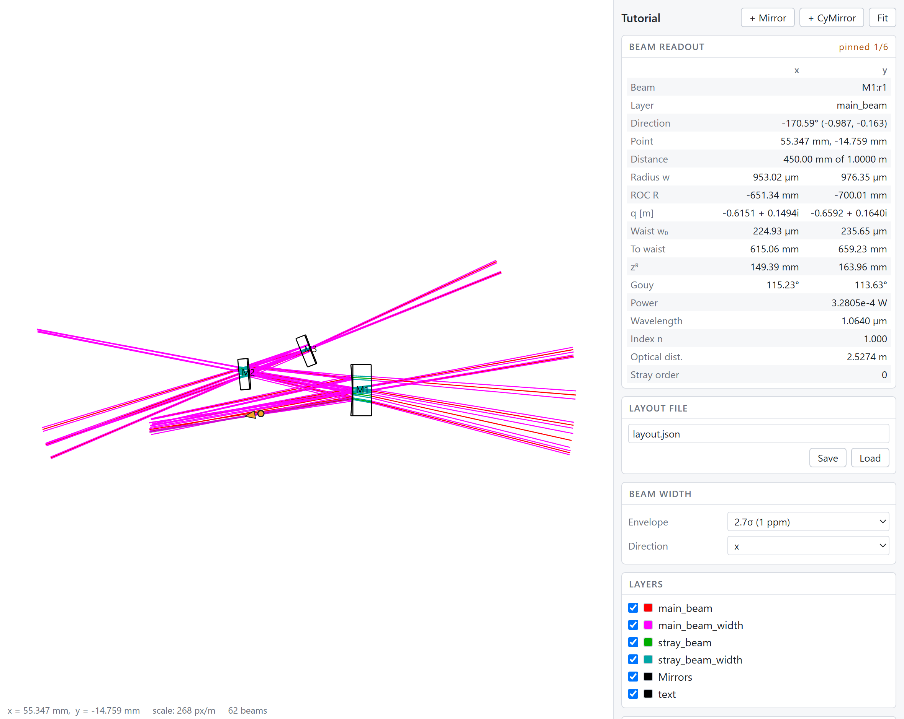
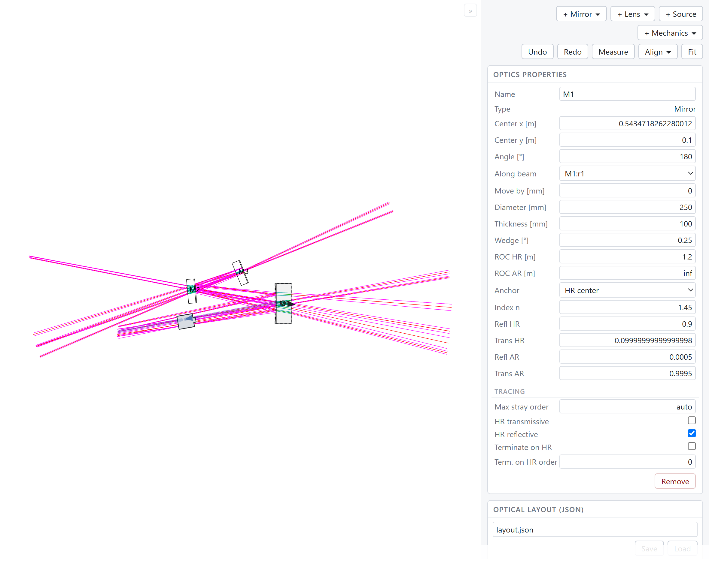
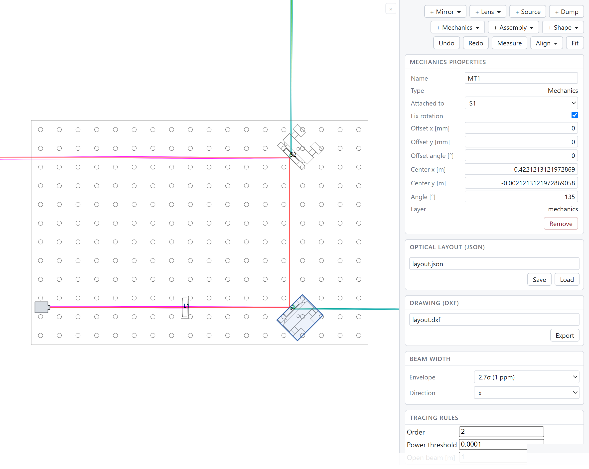
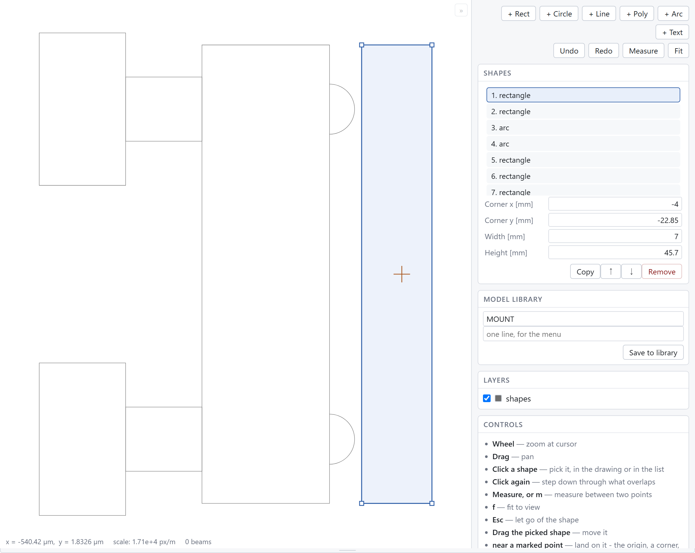

The viewer
===============================

The viewer draws a traced layout in a browser, and lets you edit the layout
there. You can read the beam parameters at any point along a beam. You can
move an element and watch the beams follow, measure across a substrate, save
the layout as JSON and export the drawing as DXF.

.. code-block:: python

    layout.show()

That is the only call you need. In a Jupyter notebook, ``show()`` puts the
viewer in the cell output. Anywhere else it writes a self-contained HTML
file and opens that file in your browser.

The viewer inside a notebook is an ``anywidget`` widget.
``pip install "gtrace[notebook]"`` installs that widget. The command does
not install Jupyter itself; ``pip install jupyterlab`` does. A plain
``pip install gtrace`` does not install the widget, and ``show()`` then
always writes the HTML file.

   The viewer with a beam clicked. The drawing area is on the left, the
   readout and the controls on the right.

Opening the viewer
-------------------

There are three entry points, and they differ in what they can do:

.. list-table::
   :header-rows: 1
   :widths: 34 66

   * - Call
     - What you get
   * - ``layout.show()``
     - The notebook widget in a Jupyter kernel that has ``anywidget``
       installed, and the HTML file everywhere else.
       ``show(backend='html')`` or ``backend='widget'`` overrides the
       choice.
   * - ``layout.widget()``
     - The notebook cell output. A Python kernel is running behind the
       widget, so the widget can **edit and re-trace**.
   * - ``layout.render_html('trace.html')``
     - One file with the scene, the viewer code and the styling inlined.
       You do not have to install or serve anything. The file is
       **read-only**: you can pan, zoom, read beam values and measure, but
       not move anything.

All three drive the same viewer, so they show the same picture and report
the same numbers.

Moving around the drawing
--------------------------

.. list-table::
   :header-rows: 1
   :widths: 34 66

   * - Gesture
     - What it does
   * - Wheel
     - Zoom, centred on the cursor.
   * - Drag the background
     - Pan.
   * - ``Fit`` button, or ``f``
     - Fit the whole layout in the view again.
   * - Layer panel
     - Switch layers on and off one by one. You can hide the stray beams
       without running the trace again.
   * - ``Esc``
     - Leave the current mode and clear the selection.
   * - Drag the grip at the end of a beam
     - Draw a beam that reaches nothing longer or shorter. See
       :ref:`drawing-a-beam-longer`.
   * - ``Delete``
     - Remove the selection. The same as the ``Remove`` button of the panel
       currently shown. If nothing is selected, or a beam is selected, the
       key does nothing. The key works while the pointer is over the
       viewer, and the viewer does not pass the key on: in a notebook,
       ``Delete`` deletes a cell.

Making room for the drawing
^^^^^^^^^^^^^^^^^^^^^^^^^^^^

A notebook cell is wide and short. A bench drawing usually is not. There
are three ways to give the drawing more room.

**Drag the bottom edge.** A grip runs along the bottom of the widget. Drag
the grip down to make the viewer taller.

**Fold the side panel away** with the small button at the top right of the
drawing area. The drawing area then takes the whole width. The button stays
where it was, now pointing the other way, and brings the panel back.

**Set the height in Python**: ``layout.show(height=700)``, or
``w.height = 700`` afterwards.

The three ways differ in whether they reframe the drawing. Dragging the grip
does not: the view stays where you put it. Dragging writes the new height
back to the ``height`` traitlet, so the height survives a re-render and
``w.height`` reports the height you dragged to. Setting the height from
Python does reframe, because a height chosen there is usually a request to
see the whole layout at that size.

With no height given, the widget takes its height from the width of the
output area, so the drawing area starts as tall as it is wide. The widget
measures the width of the *drawing area*, not the width of the widget. The
side panel is a fixed strip, so squaring the whole widget would leave the
drawing area taller than it is wide, which is the wrong shape for a bench.
The height is capped to the window height. Split the notebook pane and the
drawing area becomes square again.

The grip exists only in the widget. The HTML file already fills the browser
window.

Reading a beam
---------------

Click anywhere on a beam, not only at a vertex. gtrace projects the point
onto the beam segment and advances the q-parameter to that distance. The
panel then reports the beam parameters **at that point**. The x and y
directions are reported separately where they differ:

============================ ==============================================
Radius ``w``                 Beam radius at the clicked point
ROC ``R``                    Radius of curvature of the wavefront there
``q``                        The complex q-parameter itself
Waist ``w₀``                 Radius at the waist of this beam
To waist                     Distance from the clicked point to the waist
``z_R``                      Rayleigh range
Gouy                         Accumulated Gouy phase
Power, wavelength, ``n``     Properties of the beam
Optical dist.                Optical path length accumulated so far
Stray order                  How many ghost reflections produced this beam
============================ ==============================================

``pinned 1/8`` in the corner of the panel means eight beams pass through the
point you clicked. Click the same place again to step through them. Beams
often lie on top of one another. A beam and its return share a line, and a
stray beam often runs along a main beam, so a single click cannot separate
them.

A DXF file holds geometry only, with no beam parameters in it. The readout
therefore comes from the model, not from the drawing.

.. _drawing-a-beam-longer:

Drawing a beam longer
^^^^^^^^^^^^^^^^^^^^^^

A beam that reaches nothing is drawn at a fixed length. For a beam the
trace made, that length is the **Open beam** length in the tracing rules,
one metre unless you change it. For the beam a laser fires into empty
space, it is the **Free length** of that laser. Sometimes you want to
follow such a beam further, to see where it would land, or to find room
for the element that will catch it.

**Click such a beam and a grip appears at its far end. Drag the grip to
draw that beam longer or shorter.** The status bar gives the length while
you drag, and the length the trace gave the beam beside it. Dragging back
near that length snaps to it exactly, which restores the traced length;
hold **Alt** to drag past it.

Only a beam that reaches nothing has a grip. A beam that ends on a surface
is as long as the distance to that surface, and drawing it longer would
draw it through the glass.

**Dragging the grip changes the drawing and nothing else.** A beam that
reaches nothing still reaches nothing at any length: it missed everything
because nothing is in its way, not because it was too short. No beam is
added, removed or recomputed. A DXF exported while the beam is drawn long
shows the beam at that length.

**The next trace discards the new length.** Move an element, edit a
property, undo anything: the trace runs again, and the beam is drawn at the
rule's length once more. In Python the same edit is
:py:meth:`stretch_beam<gtrace.layout.OpticalLayout.stretch_beam>`.

.. _the-lasers:

The lasers
^^^^^^^^^^^

Each registered source is drawn as a small box at the point its beam comes
from, and the beam leaves through the nose of the box. The box shows which
beams you placed yourself. A source is traced from a *copy* of itself, so
its own beam looks like the beams the trace made from it.

The box is drawn in screen pixels and keeps its size as you zoom. A layout
can be one bench or one kilometre long, and a box sized in metres would be a
dot on the long layout and would cover the short one. The box is a marker,
not a part, and it is not exported to DXF. There is one exception. Zoom in
far enough and the drawn beam becomes wider than the aperture it comes out
of. From that zoom level on, the box grows as you zoom in further, so the
aperture stays as wide as the beam.

The box sits *behind* the point the beam leaves from, so it does not cover
the beam. A click picks the box before any element underneath it. Clicking
a laser opens the source properties, on a read-only page as well as in the
notebook.

Looking at an element
----------------------

Click an element and the panel shows its properties.

   A mirror selected. Position and angle at the top, then the substrate,
   then the coatings, then the flags that decide how deep its ghosts are
   followed.

Position is in metres, because it is a distance across the bench. The
dimensions of the part are in millimetres: the diameter, the thickness, the
radius of curvature and the focal length. A catalogue lists them that way,
and typing ``0.075`` for a 75 mm lens is easy to get wrong. Adjustments such
as **Move by** and **Line offset** are in millimetres too.

Curvature is presented as a **radius**, not as the ``inv_ROC_HR`` the model
stores. The panel converts between the two on input and output. A flat
surface is then ``inf`` instead of zero, and the number in the panel is the
number written on the mirror's data sheet.

The **Anchor** row says which point the element is held by: **HR center**,
the apex of the front face, or **substrate center**, the middle of the
glass. The anchor is the point that stays put when a curvature changes, and
the point the element turns about. A mirror pins its HR face, so sweeping
the radii of a telescope does not move the beam spot off that face. A lens
pins its middle, because the beam goes through it. See
:ref:`changing-a-curvature`.

Each edit is applied to the registered object, the layout is re-traced, and
the new scene is pushed back into the view. Your zoom, pan and layer
visibility are kept, so the picture does not move.

Typing a number
^^^^^^^^^^^^^^^^

**A numeric row is a calculator.** You usually compute a bench measurement
instead of knowing it, so a row takes the sum as well as the answer:
``2*25.4`` is 50.8, and ``300/4`` is 75. A row accepts brackets, the four
operations and a leading minus, and nothing else. The text is parsed, not
evaluated as code.

A value may also carry **a unit of its own, in square brackets**, and the
row converts the value into the unit it is labelled with: ``1[in]`` in a
millimetre row is 25.4, in a metre row 0.0254.

.. list-table::
   :header-rows: 1
   :widths: 20 80

   * - Kind
     - Units
   * - Length
     - ``m``, ``cm``, ``mm``, ``um``, ``nm``, ``in``, ``mil``, ``ft``
   * - Angle
     - ``rad``, ``mrad``, ``deg``
   * - Power
     - ``W``, ``mW``, ``uW``, ``kW``

The unit converts the number it follows. Everything after that is ordinary
arithmetic in the unit of the row, so ``1[in]+2`` in a millimetre row is
27.4. A unit of the wrong kind is refused: a length does not convert into
an angle. A row that has no unit of its own, such as an order or a
refractive index, refuses every unit. A refused entry is not sent, and the
row goes back to the value the model holds.

Lenses
^^^^^^^

Selecting a lens adds a **Focal length** row, directly under the type. The
row comes first because the focal length is the number that matters for a
lens. Writing a value there re-solves both curvatures together. The shape of
the lens is kept and the lens does not move, exactly as when you assign to
:py:attr:`f<gtrace.optcomp.Lens.f>` in Python. The two radii further down
follow the focal length. You may still edit the radii instead: they are the
real description of the lens, and the focal length is read back from them.

A focal length the blank cannot be ground to is refused. The reason is shown
in the panel, and the lens is left as it was. ``inf`` is refused before it
is sent. A lens with no power is a flat window, which is a different
element.

Editing a source
^^^^^^^^^^^^^^^^^

Clicking a laser opens the source panel. Drag the box to move the laser,
hold Shift to turn it, or type the numbers into the panel. A laser turns
about the point its beam comes from. That point *is* the source, so the
nose of the box stays put while the rest of the box turns.

**The beam is given as its waist, not as a q-parameter.** Four rows
describe it: the waist size in each direction, in millimetres, and the
position of that waist, in metres from the laser forward along the beam. A
laser is specified by its waist, and mode matching is done in those terms.

The remaining rows are the wavelength (in nanometres), the power, the
refractive index of the medium the laser fires into, and a **Free length**.
Free length is how far the beam of this laser is drawn while it reaches
nothing. A layout is in that state while you are building it. Once the beam
hits something, the trace cuts the beam there and the number no longer
matters. The beams the trace itself makes use the **Open beam** length in
the tracing rules instead; see :ref:`drawing-a-beam-longer`.

Changing the wavelength keeps the waist and changes the divergence; see
:ref:`editing-a-source`.

Adding objects
---------------

There is one add button for each kind of object: ``+ Mirror``, ``+ Lens``,
``+ Source``, ``+ Dump``, ``+ Mechanics``, ``+ Assembly`` and ``+ Shape``.
Two of them have variants, spherical and cylindrical, and open a menu with
that choice. A cylindrical mirror is a mirror, not a separate kind of
object.

.. _putting-something-down:

**Everything is put down by clicking where it goes.** Pressing an add
button, or choosing a variant from its menu, arms a tool. The button stays
lit and the status bar asks for the place. The object is added only when you
click on the drawing. **Esc** cancels and adds nothing.

The click takes the same marked points a measurement does, so a new part
lands exactly on a screw hole, on the corner of a breadboard, on the face
of a mirror already down, or on the origin. The status bar names the point
under the cursor before you click it. See :ref:`measuring <measuring>` for
what those points are.

What the click gives depends on the kind:

.. list-table::
   :header-rows: 1
   :widths: 30 70

   * - Kind
     - What the click gives
   * - Mirror, lens
     - The centre of the HR face.
   * - Source
     - The point the beam comes from, which is the nose of the box.
   * - Dump
     - The centre of the dump.
   * - Mechanics
     - The centre of the part.
   * - Assembly
     - The place of the element: the centre of the HR face for a mirror,
       the centre for a lens. The mount or holder, the pedestal and the
       fork are built around that point.
   * - Shape
     - As many places as the shape needs. See :ref:`below
       <drawing-a-shape>`.

The viewer does not ask which way the new object faces. A new element faces
along the −x axis and a new laser fires along +x. Turn the object afterwards
with **Align**, with Shift + drag, or with the ``[`` and ``]`` keys.

.. list-table::
   :header-rows: 1
   :widths: 22 78

   * - Button
     - What it puts down
   * - ``+ Mirror``
     - A mirror. The new mirror takes the parameters it was not given from
       the element registered last, so a mirror added to a system of 10 cm
       optics is 10 cm as well. Put down a beam dump of 50 mm just before,
       and the new mirror is 50 mm.
   * - ``+ Lens``
     - A catalogue lens, 500 mm and one inch across. The lens inherits
       nothing from the optics already registered. A lens given the 99 %
       front face of a mirror would not pass the main beam. Both faces
       reflect nothing, so the lens makes no ghosts. Put a real coating in
       **Refl HR** and **Refl AR** when you want the ghosts from a lens.
   * - ``+ Source``
     - A laser firing along +x, at 1064 nm, 1 W, with a 0.2 mm waist at the
       laser. The new laser copies nothing from the sources already there.
   * - ``+ Dump``
     - A :ref:`beam dump <mechanics>` facing a beam that runs along +x:
       two absorbing faces and the housing they sit in.
   * - ``+ Mechanics``
     - Opens the model library. A mount, pedestal, fork, holder or
       breadboard.
   * - ``+ Assembly``
     - An element **with the parts that hold it**.
   * - ``+ Shape``
     - One drawing primitive as a body of its own, **drawn by clicking
       where it goes**.

**What is added is named for what it is**: a mount comes down as ``MT1``, a
pedestal as ``P1``, a fork as ``FK1``, a holder as ``HLD1`` and a breadboard
as ``BB1``. The model supplies the name through its ``prefix``, and a model
without a prefix gives ``H1``. A shape put down with ``+ Shape`` is named
for the shape it is: ``CIRC1``, ``RECT1``, ``LINE1``, ``POLY1``, ``ARC1``,
``TEXT1``.

**A mirror assembly stands by the centre of its HR face, and a lens
assembly by its centre.** That is the point the click gives, and the point
each element is placed by everywhere else. A beam turns at the HR face of a
mirror, and the distances between elements are measured to that face. A
lens is symmetric about its centre, and its holder is drawn around that
centre. The two points are half a substrate apart: 3 mm on a one inch
mirror, 6.35 mm on a two inch one. A mirror placed by its centre therefore
lands that far behind the point you clicked.

``+ Assembly`` puts down a one inch or two inch mirror in its mount, or a
lens in its holder, on a pedestal held down by a clamping fork. That is what
is really bolted to a bench. Building the same stack from four adds and
three attachments would be four steps of undo, and you would have to look up
three offsets. One message makes all four parts, so a whole assembly is
**one step of undo**. The parts are attached to the element: drag the
mirror, and the mount, the pedestal and the fork come with it. The names
follow the same rule: ``M2`` held by ``MT2`` on ``P2`` in ``FK2``.

``+ Shape`` offers the six drawing primitives: rectangle, circle, line,
polyline, arc and text. It makes a body of that single shape, for example a
tank wall, an aperture, the edge of a table, or a note on the drawing. The
button does the same as writing ``Mechanics(shapes=[draw.Circle(...)])`` in
a cell.

.. _drawing-a-shape:

**A shape takes more than one click.** Everything else is put down by one
click, which only says where it goes. A shape is drawn, so its clicks say
what it is as well.

.. list-table::
   :header-rows: 1
   :widths: 22 78

   * - Kind
     - What the clicks say
   * - Line
     - Both ends.
   * - Rect
     - Two opposite corners.
   * - Circle
     - The centre, then a point on it.
   * - Arc
     - The centre, then where the arc starts, then where it stops. The arc
       runs counterclockwise from the start point to the stop point. The
       third click only gives an angle, so it need not be on the circle.
   * - Poly
     - A corner per click. **The right button finishes it.**
   * - Text
     - Where the text goes.

While you draw, the shape is drawn as it would be if the next click were
where the cursor is, and the status bar says which place it is asking for.
**Esc** cancels a half-finished shape. For a shape that finishes itself, the
right button cancels as well.

**The clicks take the same marked points a measurement does** — the corners
and apexes of an element, the middle of a straight edge, the screw holes of
a breadboard, the ends of a beam. A shape therefore lines up exactly with
what is already there.

The body is held at the middle of what was drawn, and the shape is written
about that point. The pose of a body says where the body is, and holding the
shape about its middle keeps that true for a hand-drawn body.

**The size is what you drew**, so it does not depend on how far the view was
zoomed. The one exception is the height of a piece of text: a click says
where the text goes and nothing says how big it is, so the text is sized to
the width of the view. Type the number you want into the panel afterwards.

Placing objects
----------------

Dragging an element moves it. An element turns about the point it is held
by, and the outline that follows the cursor is drawn about that point too.
What you see while dragging is where the element ends up.

.. list-table::
   :header-rows: 1
   :widths: 30 70

   * - Gesture
     - What it does
   * - Drag
     - Move.
   * - Shift + drag
     - Turn about the anchor point.
   * - Ctrl + drag
     - Drop the element on a beam: square across that beam and on its axis.
   * - Alt
     - Use the exact cursor position, without snapping.
   * - ``[`` and ``]``
     - Turn the selected element by ∓45°.
   * - ``a``
     - Align: aim by a line through two places.
   * - ``b``
     - Align: aim by the bisector of three places.

**Screw holes are snap points.** An element dragged near a hole puts its
anchor point exactly on that hole, because optics go on the hole grid of a
bench. A laser does the same, and puts the point its beam leaves from on
the hole. The measuring tool and Align also take the holes as marked points.

Squaring onto a beam
^^^^^^^^^^^^^^^^^^^^^

Almost every element on a bench has to sit square across a beam, with the
beam through its middle. Dragging only gets an element approximately there,
so **hold Ctrl while dragging**. Drop the element on a beam: it is turned to
face that beam and slid onto its axis. The outline snaps as soon as you
press Ctrl, so you see the result before you release the button. The status
bar names the beam the element is about to sit on.

The *element* has to be over the beam, not the cursor. A beam that passes
anywhere inside the footprint of the element counts. An element is dragged
from the point where you took hold of it, and when you are zoomed in, that
point can be far from the middle of the element.

Only the distance along the beam is taken from where you dropped the
element. Of the three numbers, that is the only one a drag can usefully
choose. The other two, the angle and the offset across the beam, are the
numbers a bench does not leave to chance. The anchor says which point of the
element lands on the axis. Ctrl with no beam under the cursor is an ordinary
move.

.. _aiming-by-places:

Aiming by places
^^^^^^^^^^^^^^^^^

Ctrl + drag answers the question "square onto *that* beam". A bench asks
another question: which way should a face look when the beam that will
strike it does not exist yet? That happens with the first mirror of a chain,
and with a mirror whose beam only appears once it is aimed. **Align**
answers from places instead of from beams, and it never moves the element.

**Line 2 points** (``a``) turns the face square across the line between two
places you click, looking from the first towards the second. A line has two
normals, and the click order says which one. Clicking the same two places in
the opposite order turns the element by 180°, which is how a face is
flipped.

**Bisect 3 points** (``b``) takes from, at, to. The face ends up on the
bisector of that corner. That is where a mirror must look to send a beam from
the first place to the last one. It is the law of reflection, given as three
places instead of an angle.

**Turn ±45°** (``]`` and ``[``) turns the element by 45° from wherever it
faces now. This is the step a steering mirror is usually placed by, since
a mirror at 45° to the beam sends it off at a right angle.

The clicks land on the same marked points a measurement snaps to: the
corners and the apexes of a substrate, the middle of each straight edge, the
ends of a beam, and **the screw holes of a breadboard**. The holes make the
aim exact instead of approximate. A mount goes on the hole pattern, and the
angle it should face is a question about two holes. The arms are drawn to
the cursor while you work, the element is outlined as it would face, and the
status bar names the angle it is about to take. Align is a mode, like
measuring. Escape leaves the mode and keeps the selection.

Moving along a beam by a number
^^^^^^^^^^^^^^^^^^^^^^^^^^^^^^^^

Aligning leaves one degree of freedom: how far along the beam the element
sits. That distance is not for the mouse to set. A lens goes where the mode
matching says it goes, so the properties panel offers the distance as a
number. Two rows appear under **Angle** whenever a beam passes through the
selected element.

**Along beam** picks which beam, from those that reach the element. A 45°
mirror has both an incoming and an outgoing beam through it, so you have to
say which beam "along" refers to. The nearest beam is chosen at first.

The list is also a picker, but a name like ``b0:M1t1`` does not tell you
which line in the picture it is. **Ctrl + click a beam** to choose it
instead. The row follows your click and the element stays selected. The
beam is marked along its whole length, so you can see that the name and the
line are the same beam. Click the beam away from the element: over the
element, a click grabs the element. Ctrl + click the same place again to
step to the next beam of the bundle.

The mark carries an arrow halfway along it. The arrow shows which way the
chosen beam travels, and that is the direction **Move by** counts as
positive. Two beams that share one line often run in opposite directions.
Without the arrow, stepping from one to the other would leave the picture
unchanged while the sign of every move reversed.

**Move by [mm]** is a distance to move, not a position. Type the distance,
press Enter, and the element slides that far, positive in the direction the
beam travels. The field returns to zero at once, so holding Enter down does
not walk the element along the bench. The orientation and the offset across
the beam stay as they were.

.. _mechanics-in-the-viewer:

Mechanics on the bench
-----------------------

Bodies are drawn on the ``mechanics`` layer: breadboards, mounts, clamps,
the wall of a vacuum tank. They are picked, dragged and edited like
everything else, with three differences.

   A small bench: a lens and two steering mirrors, each in a mount, on a
   breadboard. The selected mount is attached to its mirror, so its pose is
   greyed out. The pose is derived from the host, not stored.

**They are picked last.** A breadboard covers most of a bench, so a click
lands first on the beam or the element in front of it. A click reaches the
board only where there is nothing else. Where several bodies overlap, the
smallest one wins, so a board does not hide a mount standing on it. To reach
a mount that is completely hidden under its own mirror, click the same place
again.

**They are dragged only once selected.** A press on an unselected board
usually means "pan the view", not "move the bench". The first click
therefore selects the board, and only after that does dragging move it. An
attached body cannot be dragged at all, because it goes where its host goes.
If its rotation is free, Shift + drag turns it about the point it is held
by.

**A drag snaps to the marked points.** Most of the points a measurement can
snap to are also places where a part can go:

* the screw holes of a breadboard;
* the corners and centres of the other bodies;
* the points a part names for itself, such as the hole under a mount, the
  axis of a pedestal or the bore of a fork.

The middle of an edge is the exception. It is a place to measure from and to
aim by, not a fixing: nothing is bolted to the middle of the side of a plate,
and offering it here would let it win over the screw hole a few millimetres
away that the part is really going onto.

Drop a pedestal near the hole under a mount and the pedestal lands on the
hole exactly. Hold Alt to use the exact cursor position. The status bar
names the point the drag caught on.

Sizing a body
^^^^^^^^^^^^^^

A body that has a size carries four corner handles while it is selected. A
breadboard is such a body, and so is anything else built with parameters.
Dragging a handle cuts the body to a new size, with the opposite corner
fixed. Python drills the hole grid again instead of scaling it, so the holes
keep their diameter and their pitch.

**A round board is cut to a diameter.** A vacuum tank is round, and so is
the board in the bottom of it. Such a body has one size, not two. The panel
offers a single **Diameter** row instead of Width and Height, and a dragged
corner sets that one number. The centre stays where it is, because a disc
has no opposite corner to hold still.

**A body that is one shape drawn by hand is edited by that shape.**
``+ Shape`` puts down such a body. The panel shows the rows of the shape
under the pose rows: a radius, a width and a height, the ends of a line, or
the angle of a turned rectangle. The grips of the shape appear on the
drawing. A drag on a grip is computed in the frame of the body, so the grip
lands where you release it, whatever the angle of the body. A part of
several shapes is drawn in the :ref:`shape editor <the-shape-editor>`
instead, where there is a list to pick from. An attached body is edited
through its host.

Attaching and assembling
^^^^^^^^^^^^^^^^^^^^^^^^^

**Attached to** in the panel of a body is a menu of the elements **and of
the other bodies**. A bench stacks: a mount goes on a pedestal, and a
pedestal is held by a fork. Choosing an element seats the body at the place
its model gives. Choosing a body keeps the body where it already is, which
is where the snap put it. ``(free)`` releases the body where it stands.
**Offset x/y** and **Offset angle** move the body away from that place on
purpose. The pose of an attached body is shown greyed out, because it is
derived from the host.

**Fix rotation** decides whether the body may be turned while it is held.
With **Fix rotation** off, the ``Angle`` row and Shift + drag turn the body
about the point it is pinned by, for example a fork about its post. The body
still turns with the host.

**Assembled to** in the element panel says what an *element* follows. The
far face of a beam dump follows the near face, and the second mirror of a
periscope follows the first. Pick an element or a body, and the selected
element starts following it from where it stands. Pick **(free)** and it is
on its own again. The menu does not offer the element itself, and it does
not offer anything that already follows the element: a pose that comes from
itself has no value.

While an element follows something, **Center x**, **Center y**, **Angle**
and **Move by** are decided by the host. They show where the host put the
element, and they cannot be typed into. A value accepted there would be
overwritten at the next trace. The exception is the angle of the element
when **Fix rotation** is off, which is how the opening of a V is set.
**Joint x**, **Joint y** and **Joint angle** are where the element sits in
the frame of the host. They move the element without releasing it.

**Remove**, or the ``Delete`` key, takes the selection away. The key does
what the button of the panel currently shown does, so it removes an element,
a laser, a body or a dimension, and it does nothing while the beam readout
is showing: a beam is what a trace made, not something the layout holds. In
the :ref:`shape editor <the-shape-editor>` the key removes the shape
currently shown. A named point has its own **- Point** button, and the key
leaves the point alone.

**Remove takes what stands on the removed object**: the mount on the mirror,
the pedestal under the mount, the far face of a dump and its housing. If
they were left behind, each one would derive its pose from something that is
no longer in the layout. The removal is one step of undo, so a removal that
took more than you meant is one Undo away. To keep something, let it go
first with **(free)**.

**Copy** in the element panel adds a second copy of the element, with
everything standing on it. Each copied part is pinned to the copy as its
original is pinned to the original element. The copy stands its own diameter
away and is selected, so it can be dragged straight to where it belongs. See
:ref:`mechanics` for what is and is not copied.

Names are not drawn for a body. A bench has more bodies than optics, and a
picture labelled with three mounts and a board is harder to read than a
picture without those labels. ``drawMechanicsNames=True`` draws the names.

.. _the-shape-editor:

Drawing a part
---------------

:py:meth:`Mechanics.edit<gtrace.mechanics.Mechanics.edit>` opens a part in
an editor of its own:

.. code-block:: python

    from gtrace.mechanics import mirror_mount

    part = mirror_mount(name='MY-MOUNT')
    part.edit()

   A mirror mount open in the shape editor, with one of its plates picked.
   The shapes are listed in the order they are drawn, and the picked one
   stands on grips.

The editor is the same viewer, given a scene of nothing but the shapes of
one body, drawn in the frame they are written in, **with the origin
marked**. When the part is attached, the origin sits at the centre of the
host's substrate. Seeing the origin is most of what it takes to get a part
right. Zoom, pan, undo, measuring and the layer panel work unchanged.

The side bar is different in the editor. It has four parts:

* buttons that draw a rectangle, circle, line, polyline, arc or text. They
  work as :ref:`+ Shape <drawing-a-shape>` does on a bench: the button arms
  a tool, and the clicks say where the shape goes. The button of the kind
  being drawn stays lit until the shape is drawn or **Esc** cancels it;
* the list of shapes, in the order they are drawn. You pick a shape here,
  copy it, move it earlier or later, or take it away;
* the numbers of the picked shape, in millimetres and degrees;
* **Save to library**, which registers the part under a name, a line of
  description and a name prefix.

You can also work on a shape in the drawing. A click picks a shape, by its
outline or by the area it encloses, and the smallest one wins. Click the
same place again to step down through the shapes that overlap. Drag the
picked shape to carry it.

The picked shape stands on grips, one grip for one number:

* the four corners of a rectangle, with the opposite corner staying put;
* a point on the rim of a circle, for its radius;
* the two ends of a line;
* where an arc starts, where it stops, and how far out it runs;
* one grip per vertex of an outline.

A turned rectangle is gripped by the corners it really has. A drag on one of
those corners is computed along the axes of the rectangle, so the width
stays the width and the height stays the height. Shift + drag turns a shape
about the middle of its box, and ``[`` and ``]`` turn it 45° at a time.

A drag snaps to the marked points: the origin, and the corners, centres,
vertices and edge midpoints of the other shapes, and the named points
described below. Hold Alt to use the exact cursor position. A polyline is
edited vertex by vertex. The rows work on the vertex the grips pick out.
**+ Vertex** puts a new corner in halfway to the next one, and **− Vertex**
takes the picked vertex away.

**Named points** have a panel of their own. These are the points the part
names for itself: ``'post'`` for the hole a mount is bolted down through,
``'axis'`` for a pedestal, and ``'bore'`` for a fork. One part is stood on
another by these points, so they belong to the part and not to any one
shape. Each point is drawn as a small ring with its name beside it, in the
amber of the origin cross.

Pick a point from the list, or click its ring, and the rows give its
**Name** and its position in millimetres. Drag the ring to carry the point;
it snaps to the same marked points a shape does. A ring is picked before the
shapes under it, because a ring is a small mark and a shape is an area. A
ring is picked after the grips of the shape currently shown. **+ Point**
names a point at the origin, with a placeholder name to type over.
**− Point** takes the picked point away.

Named points are how you place a point that no drawing shows. A mount is
bolted to its pedestal from underneath, so its post hole does not appear in
a top view. The position of that hole still belongs in the top view.
``mirror_mount()`` therefore names the point and also draws a circle at it.
The circle and the named point are separate: the circle is a drawing, and
the name is what a part is stood on.

A part is stood on something by a name, so two points cannot share one name,
and a point cannot go unnamed. Every gesture commits as one message, so each
gesture is one step of undo. The editor works on the body itself, by
reference, so a part already registered in a layout is redrawn there as soon
as the layout is drawn again.

.. _measuring:

Measuring
----------

**Measure**, or ``m``, arms the measuring tool. It takes three clicks: two
to say what is being measured, and one to say where the line goes.

.. figure:: tutorial/figures/viewer_measure.png
   :width: 100%

   A measurement across the substrate of ``M1``, from the apex of its HR
   face to the apex of its AR face. The span runs inside the glass, so the
   optical distance is written under the line as well. The line itself has
   been carried clear of the element, with extension lines back to the two
   points.

The third click sets how far aside the dimension line is carried. The third
click exists because the two points you want to measure are usually in the
busiest part of the drawing: along a beam, or through an element. A line
drawn straight between them lands on top of that beam or that element, where
you can neither read the line nor grab it. How far to carry the line aside
is a choice about the drawing, so you make it by eye. Extension lines then
run back to the two points, as on any engineering drawing.

Between the first two clicks, a line follows the cursor and the status bar
reports the distance so far. After the second click, the dimension is
previewed as a dashed line, and the cursor sets how far aside it goes. Near
the span itself the offset is zero, so you can still draw the line straight
between the two points.

**Esc** puts the tool away at any stage, and drops a half-placed dimension.
The tool disarms itself after the last click. The new dimension is then
selected, so its numbers are in the panel straight away. While the tool is
armed, nothing else responds to the mouse. That keeps a drag from moving the
element you are measuring.

Snapping
^^^^^^^^^

The first two clicks take the nearest marked point, if there is one within
reach. If there is not, they take the cursor position. The marked point is
shown as a ring before you commit to it. The third click snaps to nothing.
The points being measured are exact, and where the line is drawn only
depends on where there is room. The marked points are:

* the four **corners** of each substrate, where the wedge and the sagitta of
  a curved face put them;
* the **apex of each face** and the **middle** of each substrate — the same
  points :ref:`changing-a-curvature` calls the anchors;
* the **middle of each straight edge**: the two sides of a substrate, and the
  four edges of the outline of a body;
* both **ends of every beam** in the trace;
* the **screw holes** of a breadboard and the points a part names for
  itself.

A curved face offers no middle point. The middle of its chord is inside the
glass, where nothing is drawn, and the middle of the arc itself is the apex,
which is already on the list. A flat face has both at the same place, so
either point serves.

The reach is in screen pixels, so it looks the same however far the view is
zoomed. Points on a hidden layer are not offered: you switched that layer
off, so you are not looking at it. Where a beam ends on the face it hit, the
point of the element wins. That point is the exact value the model holds,
and ``M2 HR`` is a more useful label than ``b0 end``.

The dimension panel
^^^^^^^^^^^^^^^^^^^^

Clicking a dimension line shows it in the panel. The rows are its name, both
ends, and **Line offset**, which is where the line was carried to. Both ends
are editable, so a measurement placed by eye can be given exact coordinates
afterwards. Under **Measurement** come the distance, its two components
**Δx** and **Δy**, and its direction. **Remove** takes the dimension off the
layout.

The components are there because a bench is built on axes. A mount goes 300
along and 75 across, and that pair is wanted as often as the straight line
between the points. The components are signed from the first point to the
second.

**Line offset** is in millimetres: adjust it until the line clears whatever
it was covering. Positive is to the left of the way the two points run, and
zero puts the line straight between them. The offset changes nothing about
what was measured.

Three more rows appear when the whole span runs inside one substrate: which
element it is inside, that element's refractive index, and the **optical
distance**, which is the physical one times the index. They are absent
otherwise; see :ref:`dimensions` for why an optical distance is reported for
that case and no other.

A dimension is picked by its **line**, not by the span between the measured
points. That span usually runs along a beam or through an element. You
carried the line aside so that you would not have to take hold of it there.

Dimensions are part of the layout, not a scratch overlay. They are saved
with it, come back with it, and are taken back by undo.

.. _measuring-without-python:

Measuring without Python
^^^^^^^^^^^^^^^^^^^^^^^^^

**You can measure on the static HTML file too.** Everything the tool needs
is already in the page, so a colleague you send the file to can take
dimensions from it. Two features are missing there, because Python would
have provided them:

* **No optical distance.** A dimension drawn by the reader gets only its
  physical length. Whether a span runs inside a substrate is a question
  about the surfaces, and the surfaces are in the model, not in the
  drawing. The dimensions the layout already carried keep their optical
  distance, because Python computed it before the file was written.
* **The measurement is not saved.** A measurement lasts as long as the
  page, and it belongs to the reader: **Remove** takes back what the reader
  drew, and nothing else. A read-only viewer therefore cannot appear to
  change the layout it was given.

The same applies to a widget made read-only with ``editable=False``, where a
scene pushed by ``update()`` replaces the reader's measurements along with
everything else.

Changing what is traced
------------------------

Two groups of controls in the side bar change the picture. They differ in
whether they re-trace.

**Beam widths** choose how the envelope is drawn: the width in units of the
1/e² radius (1 σ, 2.7 σ or 3 σ), and which transverse direction the envelope
shows (x, y or their average). The default is 2.7 σ in x. See
:ref:`why-2.7-sigma` for what those numbers mean. Changing either one
redraws the picture, and does not trace again: the display changes, the
physics does not. These controls are absent from the static HTML, because
redrawing needs Python. Choose there at write time with
``render_html(..., width_mode='y')``.

**Tracing rules** are the three rules the trace runs under: the **Order**,
the **Power threshold** and the **Open beam** length. These are the numbers
to change when you look for stray beams. Lower the threshold and the trace
finds fainter paths, and takes longer. Changing one of these **re-traces**,
and the picture that comes back has more or fewer beams in it. See
:py:class:`TraceRules<gtrace.layout.TraceRules>`.

Undo and redo
--------------

**Undo** in the side bar, or Ctrl + Z with the pointer over the viewer, puts
the layout back as it was before the last edit. Undo is disabled until there
is an edit to take back, and it walks back one edit at a time up to
:py:data:`UNDO_DEPTH<gtrace.layout.UNDO_DEPTH>` edits.

**Redo**, or Ctrl + Shift + Z or Ctrl + Y, walks forward again through the
edits that Undo took back. Redo is disabled until an undo has put an edit
aside for it. **The next edit you make discards what is waiting.** Once the
layout has changed in another way, there is no branch left to return to.

The history belongs to the layout, not to the viewer, so it covers edits
sent from a cell as well as edits made in the browser::

    layout.apply_edit({'op': 'move', 'target': 'M1', 'HRcenter': [0.8, 0.3]})
    layout.undo()               # or apply_edit({'op': 'undo'})
    layout.can_undo             # False again
    layout.redo()               # or apply_edit({'op': 'redo'})

A step of the history holds the elements themselves alongside their values,
so undoing restores those values onto those same objects. The ``M1`` of your
own code and the selection in the panel keep naming the right object,
through a rename and through a removal.

The history does not cover an assignment made directly in Python:
``M1.HRcenter = ...`` is not an edit the layout ever sees. The snapshot
taken before the *next* edit that does go through captures that value, so
undoing that next edit restores it.

A refused edit changes nothing and costs no step, so Undo after one takes
back the edit before it.

Working from a cell
--------------------

The layout holds its optics by reference, so the object you edited in the
browser is the object your own variable names:

.. code-block:: python

    w = layout.widget()
    w                       # displays the viewer; move PRM in it
    PRM.HRcenter            # shows where you moved it to

And in the other direction:

.. code-block:: python

    PRM.HRcenter = [0.6, 0]
    w.update()              # re-traces and redraws in place

``w.edits`` returns the edit messages received so far, oldest first. The
list is a record of what you did by hand. :doc:`editing` describes those
messages, which you can also send yourself.

Read-only viewers
^^^^^^^^^^^^^^^^^^

A widget built without a layout, or with ``editable=False``, shows the
readout but no editing controls. The static HTML is always read-only. There
is no Python behind the page to trace again, so an edit could not do
anything. Measuring is the exception, because measuring asks nothing of the
model.

An edit is rejected when it names an unknown attribute, gives a value
outside the permitted set, or uses a name that is already taken. A rejected
edit leaves the layout untouched, and the viewer reports the rejection.

Files
------

The side bar has two file panels. Python does all the reading and writing,
and the paths are relative to the directory the kernel runs in. The page
never gets access to your disk. Neither panel changes anything on screen, so
the viewer reports what it did in the status line.

**Optical layout (JSON)** — **Save** and **Load** write and read the layout
itself. Loading updates it in place, so the names bound in the cells above
keep pointing at the right objects. See :doc:`layout`.

**Drawing (DXF)** — **Export** writes a drawing of the layout, for CAD
software.

The two panels are kept apart, with a file name each, because they deal with
two different files. The layout is the model: save it and load it back, and
you get the same system. The DXF file is a *picture* of the model, and DXF
is an export format only. There is no Load button beside Export, because
gtrace cannot read a layout back from a DXF file.

The name of the drawing starts from the name of the layout, with the
extension swapped, so you do not type the name twice. After that the two
names are independent. An extension you type there is left alone, and a
missing extension is filled in. ``layout.widget(dxf_path=...)`` sets the
starting name from Python.

.. _dxf-export:

DXF export
-----------

The button calls
:py:meth:`export_dxf<gtrace.layout.OpticalLayout.export_dxf>`, the companion
of :py:meth:`render_html<gtrace.layout.OpticalLayout.render_html>`:

.. code-block:: python

    layout.export_dxf('layout.dxf')
    layout.export_dxf('layout.dxf', dimensions=False)
    layout.export_dxf('layout.dxf', width_mode='y')   # as draw() takes

**Dimensions are drawn, on a layer of their own.** A dimension is a note
about the system, not a part of it. CAD software offers layers for exactly
this, so the drawing carries your measurements and the person who opens it
can switch them off. Pass ``dimensions=False`` to leave them out entirely.

The ticks and the lettering are sized as fractions of the measurement, not
in millimetres. One drawing can hold a 3 m span across the bench and a 10 mm
span across a substrate. Lettering fixed at the size that suits the 3 m span
would cover the whole substrate.

Without a layout
-----------------

If you do not have an
:py:class:`OpticalLayout<gtrace.layout.OpticalLayout>`, both renderers are
callable directly, and the HTML renderer can be passed to ``drawOptSys`` in
place of the DXF one:

.. code-block:: python

    from gtrace.draw.viewer import renderHTML, html_render_func
    import gtrace.draw.renderer as renderer

    renderHTML(canvas, beams, 'trace.html', optics=optList)

    drawOptSys(optList, beamList, 'trace.html',
               render_func=html_render_func(beamList, optList))

    renderer.renderDXF(layout.draw(), 'layout.dxf')

Pass ``optics`` if you want to be able to click the elements. Without
``optics``, the viewer draws the elements but cannot identify them. This
route shows no dimensions. Dimensions belong to the layout, and ``draw()``
does not put them on the canvas. A layout sends them to the viewer as a
channel of their own, and the viewer draws them itself. To put them into a
DXF file, call
:py:meth:`draw_dimensions<gtrace.layout.OpticalLayout.draw_dimensions>` on
the canvas before you render it.
